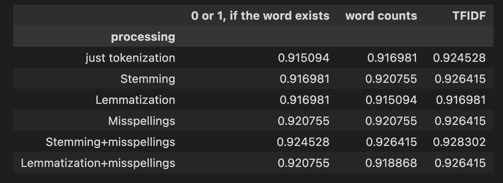
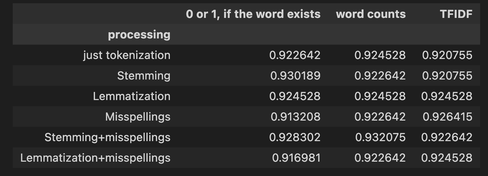
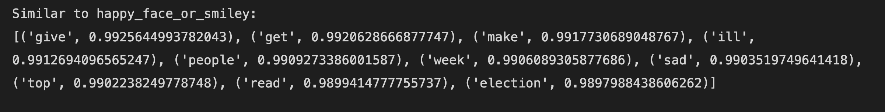

# Tweets 

Sentiment analysis of tweets. Predict whether a tweet is positive, negative, or neutral.

## Dataset

We have three files containing tweet texts, available in our [data repository](https://github.com/borolya/tweets/blob/main 'link to data'). The filename indicates the corresponding sentiment label for all tweets within it.

Examles:

- **POSIRIVE**: 	
"An inspiration in all aspects: Fashion
 fitness
 beauty and personality. :)KISSES TheFashionIcon"

- **NEGATIVE**:
"How unhappy  some dogs like it though"

- **NEUTRAL**:
"Pak PM survives removal scare
 but court orders further probe into corruption charge."

 ## Used Methods and Models:

- **NLP Preprocessing:**  
  - Remove stopwords
  - Convert emoticons to words
  - Tokenization
  - Stemming
  - Lemmatization
  - Correct misspellings

- **Transforming Tweets into Vectors:**  
  - Bag of Words
  - Word Counts
  - TF-IDF
  - Word2Vec

- **Machine Learning Classification Models:**  
  - Logistic Regression
  - Naive Bayes Classifier
  - Decision Tree
  - RandomForest

## Validtion and Results

The dataset was split into train and test datasets with an 80/20 ratio. The final metric used is accuracy. Models that showed the best results included Logistic Regression and Random Forest.

### Accuracy Table

The accuracy varies depending on the preprocessing method and vectorization technique used.

- **Logistic Regression**  
  

- **Random Forest**  
 

- **Word2Vect** 
   Word2Vec vectorization achieved an accuracy of 0.8094 after classification. It also allows us to see synonyms and antonyms for words. Observe the similar words and the strength of their similarity.
   

